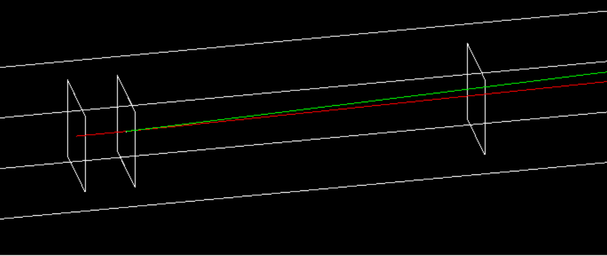
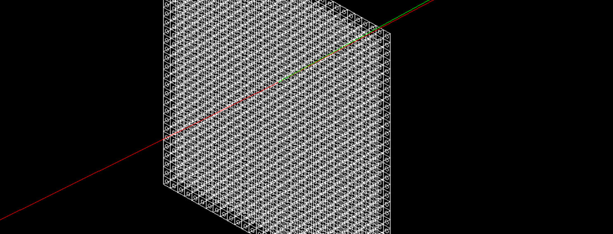

# Emittance Experiment at JETi-200
GEANT4 code to simulate the emittance experiment at JETi-200 with experimental parameters obtained from measurements using a pepper pot. The hits of the particles (electrons, positrons, and photons) are recorded at screens placed in different positions. 

The geometry is based on the emittance experiment set up at the JETi-200. In the experiment, a pepper pot (PP) was place about 181 mm downstream a LWFA gas jet target, and a YAG:Ce screen was placed 1269 mm away from the pepper pot. This screen was used to diagnose the particles hits for later to be used on the data evaluation.

**Note:** This code is based on the `GEANT4/examples/extended/electromagnetic/TestEm3` example, which is found together with the GEANT4 installation files.

## Geometry
The geometry is based on the same experimental setup at the emittance experiment. It is composed of 4 screen planes at different positions and a pepper pot.

The positions of each geometry is as follows:
* **Screen after Source**: located 100 $\mu$m after the primary beam source position which is located at origin (0, 0, 0)
* **Screen before PP**: located 150 $\mu$m before the pepper pot
* **50 $\mu$m pepper pot (PP)**: positioned 181 mm dowstream the primary beam source.
* **Screen after PP**: located 150 $\mu$m after the pepper pot
* **YAG:Ce/Lanex screen before PP**: located 1451 mm downstream the primary beam source position
  
The pepper pot is made of tungsten (G4_W) with 50 $\mu$m hole diameter and pitch between holes of 120 $\mu$m.

The detection planes have the same material as the World volume (Galactic), which resembles vacuum conditions:
```cpp
//
  // examples of vacuum
  //

  density     = universe_mean_density;    //from PhysicalConstants.h
  pressure    = 3.e-18*pascal;
  temperature = 2.73*kelvin;
  new G4Material("Galactic", z=1., a=1.008*g/mole, density,
                             kStateGas,temperature,pressure);
```

All the geometries are hard-coded in the file **src/DetectorContruction.cc** and its header file **include/DetectorContruction.hh**.
In case modifications are required, please refer to these both files and customize the geometry for your application.

The full geometry is shown below:


The pepper pot geometry is show in detail below:



## Primary Beam Gun
The simulation supports different emittances and energy distribution of the primary electron beam. The parameters of the e-beam is also hard-coded into the source file **src/PrimaryGeneratorAction.cc** inside the function `PrimaryGeneratorAction::GeneratePrimaries(G4Event* anEvent)`:

```cpp  
  // PP experiment parameters
  G4double source_size = 23.25 * um;
  G4double divergence = 1.85 * mrad;
  
  //Laser grating parameters
  //G4double source_size = 2.65 * um;
  //G4double divergence = 2.45 * mrad;
  
  G4double peakenergy = 72 * MeV;
  G4double energyspread = 50 * MeV;
```

To edit the source size and divergence of your beam, please modify the correct variables. In this code, the experimental parameters obtained from the pepper pot and laser grating measurements are coded already. Just (un)comment the variables that you will use or not. Pretty straight forward. 

After chaning the primary e-beam parameters and saving the file, please compile the code to make sure it is working.

## Macro file
Two macro files are provided for the simulations. The macro files are `Laser_grating_experiment.mac` and `PP_experiment.mac`.

You can run those files to obtain a root file with outputs.

## Running the application
At your system, after having GEANT4 installed and the proper variables from the GEANT4 installation being populated in your bash file and terminal, create a build folder, cmake, and make the code. For example:

```bash
mkdir build
cd build
cmake -DGEANT4_DIR= $GEANT4_install_dir/lib/Geant4.10.05.p01/ ..
make -j 4
```

Now, to run an application, if you have OpenGL installed and configured, you can open the application GUI by typing: `./TestEm3`.

To run the application in batch mode:

```bash
./TestEm3 PP_experiment.mac
```

This will run the application in batch mode with the number of primaries specified in the macro file **PP_experiment.mac**.

## Post-processing

A python3 jupyter notebook is provided for post-processing the data. It relies on the python package [`uproot`](https://uproot.readthedocs.io/en/latest/basic.html). As requirement, please install it for using this file. One can also read the root files in different ways.

The post-processing jupyter notebook is located at **jupyter-notebooks/Emittance analysis-PP.ipynb**. Please open it and follow the instructions in the notebook cells.

In the notebook, it is possible to obtain the particle hits in the screens, plot as 2D-histograms, and calculate the emittance of the beam by fitting 2D-Gaussians in the phase-space of the beam.

---
## Credits
**Felipe C. Salgado** (Friedrich-Schiller-Universität Jena, Helmholtz Institute Jena)

Github: https://github.com/felipecsalgado

---
## License
“This product includes software developed by Members of the Geant4 Collaboration (http://cern.ch/geant4).”

Please see [LICENSE.md](LICENSE.md)

---
## For more information
**GEANT4:** https://geant4-userdoc.web.cern.ch/UsersGuides/InstallationGuide/html/index.html
